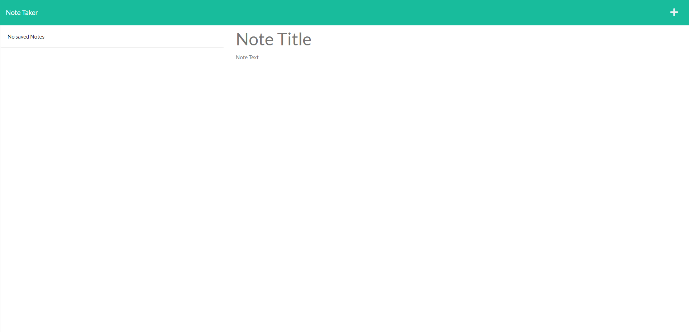
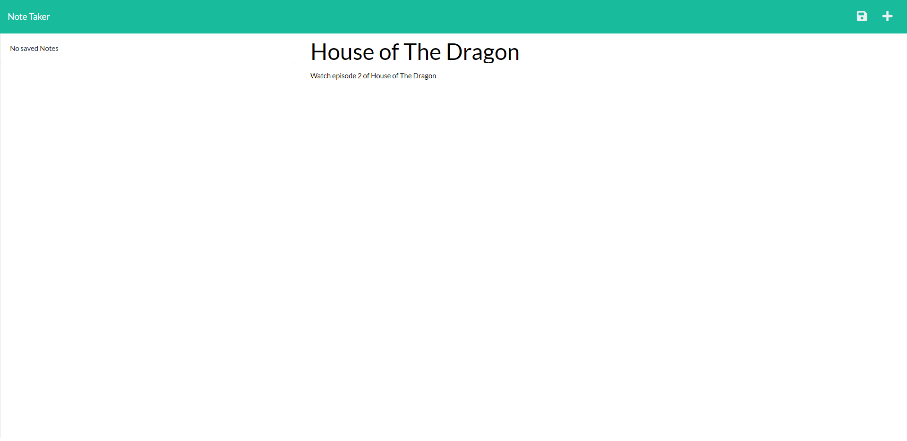
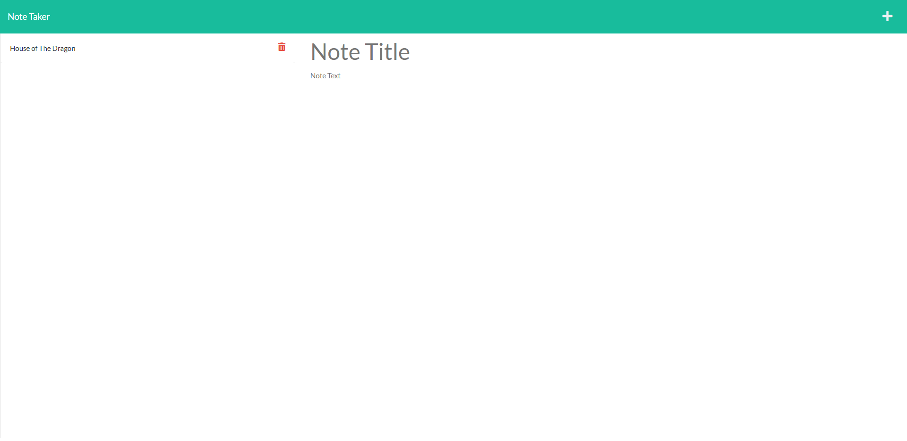

# Quick Notes

## Description

This project is a Heroku deployed web app that allows the creation of quick and easy notes with a title and text that is able to be saved and deleted.

- I built this project to challenge myself by putting the backend skills I have been learning to use.
- This project solves needing a way to write a quick and easy note that you can save and then delete when you no longer need it.
- I learned a lot about how I can route my app's backend and use it to interact with the frontend of the web app in order to increase the functionality of any web apps I build.

## Table of Contents

- [Installation](#installation)
- [Usage](#usage)
- [Credits](#credits)
- [License](#license)
- [Questions](#questions)

## Installation

No installation is required. Navigate to the deployed web app to use.

Deployed app: [Quick Notes Heroku Deployment](https://nameless-fortress-81287.herokuapp.com/)

## Usage

Use your browser to navigate to the deployed web app link, then click the 'Get Started' button to be redirected to the notes page. Once on the notes page click where it says 'Note Title' to type the title of your note and 'Note Text' to write the text of your note, click the white floppy disk save icon located on upper right side of the page to save your note. Now your note will appear on the left-hand column on the page. To view a note you have written click on the title of the note in the left-hand column. Any previously made notes you click on will be brought up for viewing on the right-hand side of the page where you write the notes. Click the white plus button on the upper right side of the page to create a new note for you to type in and add. Visit the demo video link below to watch a video demoing the creating, viewing, and deleting of notes.

Demo Link: [Quick Notes Demo](https://drive.google.com/file/d/1BaaAOPc-zcBHXybHcgmFWBJNJ0AvIqDU/view?usp=sharing)

## Credits

#### Third-Party Assets

- [Heroku](https://www.heroku.com/)
- [Node.js](https://nodejs.org/en/)
- [Express.js](https://expressjs.com/)
- [uuid](https://github.com/uuidjs/uuid)

## License

This project is not licensed.

## Questions

You can find me here:

- GitHub: [PierTwo](https://github.com/PierTwo)
- Email: <latasnoah@gmail.com>
